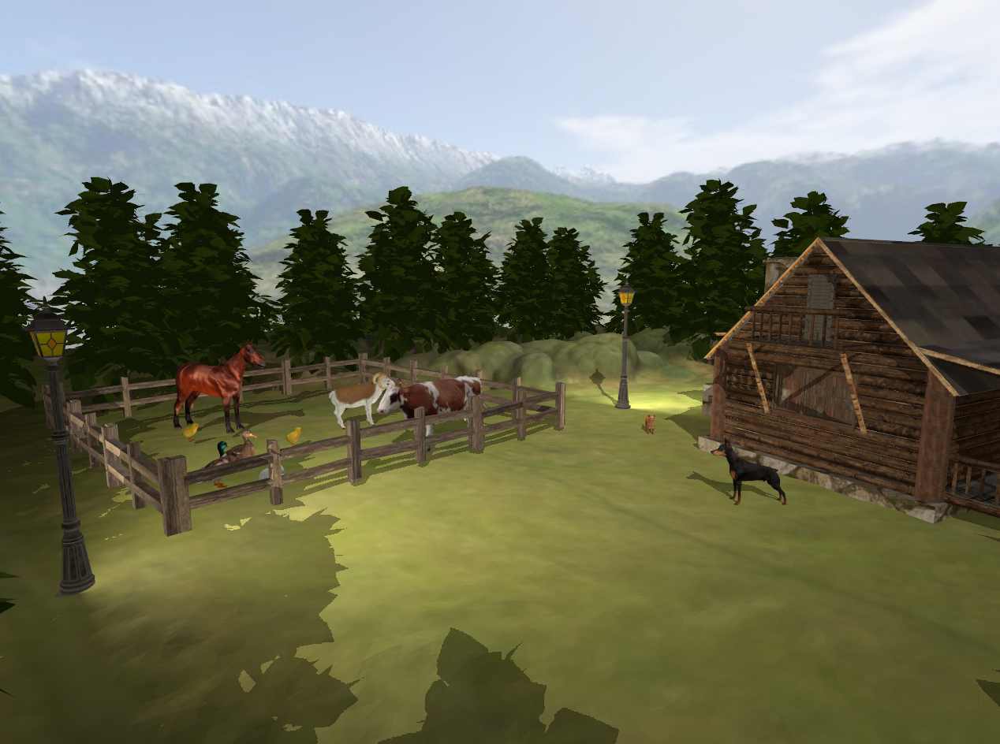
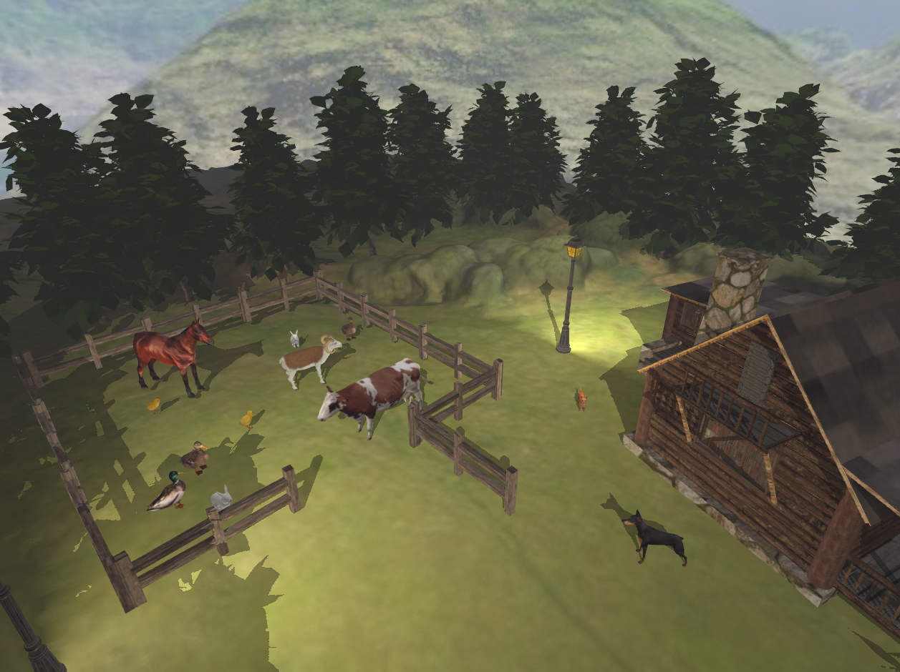
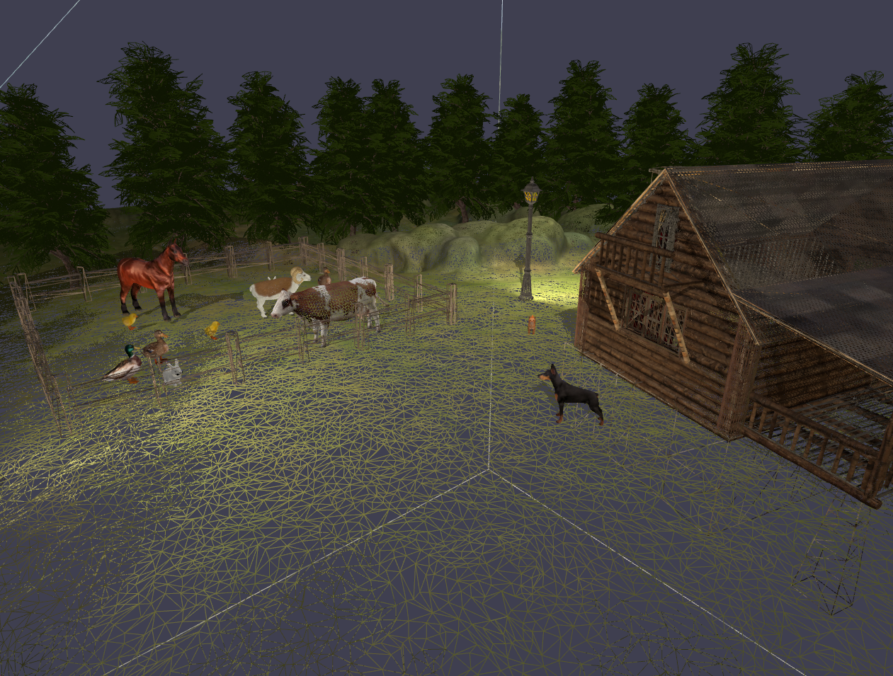

# Rural 3D Interactive Scene

A 3D interactive countryside environment built using Modern OpenGL (C++).
The project demonstrates advanced rendering techniques including shadow mapping, dynamic lighting, environmental effects, collision detection, and camera animation.

## Scene preview

  

Fog effect:

  

Wireframe view:

  

## Controls
Move and rotate camera: W / A / S / D and Mouse

Open / Close gate: G

Rotate animal model: Q / E

Toggle fog effect: F

Solid / Wireframe rendering mode: 1 / 2

Cinematic camera animation: V

Exit application: ESC

## Features
- Camera system: first-person navigation, collision detection
- Lighting system: directional, point light using Blinn-Phong shading model and distance-based exponential fog
- Shadow mapping: two-pass rendering pipeline with framebuffer object used for depth map
- Environmental effects: wind animation, skybox
- Object interaction: animated gate, dynamic collision blocking

## Architecture
The application follows a modular structure:
- Window: OpenGL context and window management
- Shader: shader compilation and  uniform handling
- Camera: view matrix, movement and rotation
- Model3D, Mesh: 3D model loading and rendering
- Skybox: cubemap background
- Main: scene organization and rendering loop

## Graphics Pipeline Overview
The rendering process consist of three main passes:
1. Shadow map generation
2. Main geometry pass
3. Skybox pass
